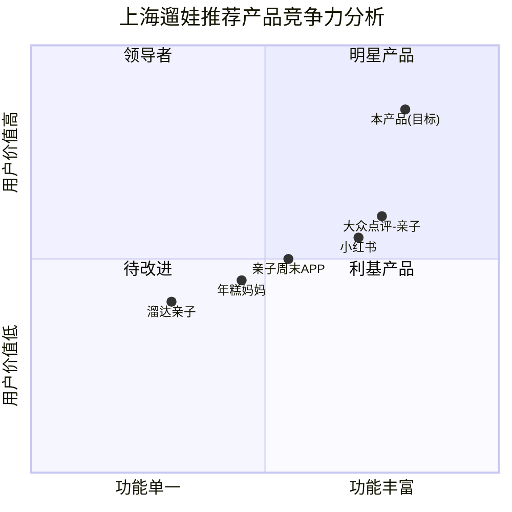

# 产品需求文档（PRD）：上海周末遛娃推荐小程序

| 项目信息 | |
|---|---|
| **项目名称** | shanghai_kidplay |
| **产品名称** | 上海周末遛娃推荐 |
| **文档版本** | v1.0 |
| **创建日期** | 2025-07-09 |
| **语言** | 中文 |
| **技术栈** | 微信小程序（Taro + React + Tailwind CSS） |

---

## 1. 产品概述

### 1.1 产品定位

一款面向上海0-6岁学龄前儿童家庭的小程序，基于大众点评、小红书、抖音等平台的高分UGC内容，结合实时天气与年龄适配算法，为家长和祖辈提供周末遛娃的智能推荐与方案对比服务。

### 1.2 核心价值主张

> **"3分钟找到本周最适合的遛娃方案"**

- **省时**：聚合多平台信息，免去家长跨平台搜索、对比的繁琐过程
- **智能**：天气+年龄+预算三维匹配，推荐最合适的方案而非最多方案
- **可执行**：直接输出Top3方案优劣对比+预约链接，从"看"到"订"一步到位

### 1.3 产品目标

| # | 目标 | 衡量指标 |
|---|---|---|
| G1 | 降低遛娃决策成本 | 用户平均决策时长 < 3分钟 |
| G2 | 提高推荐满意度 | Top3方案采纳率 > 60% |
| G3 | 形成使用习惯 | 周活用户中周复访率 > 40% |

---

## 2. 目标用户画像

### 2.1 用户画像A：年轻父母（主力决策者）

| 维度 | 描述 |
|---|---|
| **年龄** | 25-35岁 |
| **角色** | 孩子0-6岁的爸爸/妈妈 |
| **职业** | 互联网/金融/教育等白领 |
| **特征** | 双职工家庭，工作日无暇研究遛娃方案；注重早教价值、安全性、体验质量；愿意为优质内容付费 |
| **痛点** | ①信息碎片化：小红书/抖音/点评到处翻，耗时30分钟+仍拿不定主意 ②推荐同质化：搜出来的都是热门景点，人挤人体验差 ③缺乏对比维度：不知道同价位哪个更值得去 ④预约渠道分散：找到心仪地点还要再搜怎么买票 |

### 2.2 用户画像B：祖辈（实际陪伴者）

| 维度 | 描述 |
|---|---|
| **年龄** | 50-70岁 |
| **角色** | 外公外婆/爷爷奶奶 |
| **特征** | 周一到周五主力带娃；更关注距离近、交通便利、安全省力；对价格敏感；手机操作能力有限 |
| **痛点** | ①不会多平台搜索：主要依赖朋友圈/邻居口碑 ②担心天气问题：下雨天不知道能去哪 ③出行限制多：推婴儿车出行需要无障碍设施 ④预算意识强：倾向性价比高的方案 |

### 2.3 用户痛点矩阵

| 痛点 | 父母 | 祖辈 | 严重度 |
|---|---|---|---|
| 信息碎片化，决策耗时 | ★★★★★ | ★★★ | 高 |
| 天气突变无备选方案 | ★★★★ | ★★★★ | 高 |
| 不确定是否适合孩子年龄 | ★★★★ | ★★★★ | 高 |
| 预算不透明，花费不可控 | ★★★ | ★★★★★ | 中 |
| 预约渠道难找 | ★★★★ | ★★★★★ | 高 |
| 祖辈不会用复杂APP | ★★ | ★★★★★ | 中 |

---

## 3. 用户故事

| # | 用户故事 | 优先级 |
|---|---|---|
| US1 | 作为**职场妈妈**，我想在周五晚花3分钟看到本周适合2岁宝宝的Top3遛娃方案，以便快速决定周末行程 | P0 |
| US2 | 作为**外婆**，我想看到"下雨天适合去哪"的推荐，这样不用担心临时改计划手忙脚乱 | P0 |
| US3 | 作为**精打细算的爸爸**，我想按预算档位筛选（100元以内/100-200元/200元以上），这样能控制家庭月度遛娃支出 | P0 |
| US4 | 作为**重视早教的妈妈**，我想看到每个推荐的"早教价值标签"（感官发展/大运动/社交启蒙等），这样遛娃同时也能促进孩子成长 | P1 |
| US5 | 作为**不太会操作的爷爷**，我想一键跳转到预约页面直接买票，而不用自己再搜索预约方式 | P0 |
| US6 | 作为**新手妈妈**，我想看到其他家长的真实评价和避坑提示，这样能避免踩雷 | P1 |
| US7 | 作为**双职工父母**，我想把Top3方案分享到家庭群让祖辈一起选，这样全家达成一致不用来回沟通 | P1 |

---

## 4. 需求池

### P0：Must Have（核心功能，无此不可上线）

| 编号 | 需求 | 说明 |
|---|---|---|
| P0-01 | 天气智能推荐 | 根据周末天气预报自动推荐户外/室内方案，晴天优先户外，阴雨天优先室内 |
| P0-02 | 年龄适配筛选 | 按年龄段（0-1岁/1-3岁/3-6岁）推荐适配场所，过滤不适龄内容 |
| P0-03 | 成本分档推荐 | 三档预算：0-100元 / 100-200元 / 200元以上，每档推荐Top3 |
| P0-04 | Top3方案对比 | 维度对比：距离、费用、早教价值、适合天气、适合年龄、交通便利度 |
| P0-05 | 预约渠道跳转 | 每个推荐方案提供官方预约链接（小程序跳转/H5） |
| P0-06 | 多平台数据聚合 | 聚合大众点评评分+小红书笔记+抖音视频的高分内容 |

### P1：Should Have（提升体验，上线后快速迭代）

| 编号 | 需求 | 说明 |
|---|---|---|
| P1-01 | 早教价值标签 | 每个推荐标注早教维度：感官发展/大运动/精细动作/语言启蒙/社交启蒙 |
| P1-02 | 真实评价摘要 | 展示NLP提炼的UGC评价摘要（好评关键词+避坑提示） |
| P1-03 | 方案分享 | 生成图片/卡片分享到微信家庭群，支持全家投票 |
| P1-04 | 定位与距离 | 基于用户位置计算距离和预计到达时间（地铁/驾车） |
| P1-05 | 收藏与历史 | 收藏感兴趣的方案，查看历史推荐记录 |

### P2：Nice to Have（锦上添花）

| 编号 | 需求 | 说明 |
|---|---|---|
| P2-01 | 智能日历提醒 | 周四主动推送周末遛娃推荐，周一推送反馈收集 |
| P2-02 | 遛娃日历 | 标记已去过的场所，生成遛娃打卡地图 |
| P2-03 | 社区UGC | 用户提交遛娃体验，补充平台数据 |
| P2-04 | 亲子活动日历 | 聚合上海各场馆的亲子活动排期 |
| P2-05 | AI对话推荐 | 支持自然语言对话式推荐（如"明天下午3点，静安区，2岁宝宝，下雨"） |

---

## 5. 功能模块设计

### 5.1 数据采集与处理模块

```
┌─────────────────────────────────────────────────┐
│                  数据采集层                       │
│  ┌──────────┐ ┌──────────┐ ┌──────────┐         │
│  │ 大众点评  │ │ 小红书    │ │  抖音    │         │
│  │ 评分+评论 │ │ 笔记+收藏 │ │ 视频+点赞 │         │
│  └─────┬────┘ └─────┬────┘ └─────┬────┘         │
│        └─────────────┼───────────┘               │
│                      ▼                            │
│              ┌──────────────┐                     │
│              │  数据清洗引擎  │                     │
│              │ - 去重合并     │                     │
│              │ - 地址标准化   │                     │
│              │ - 价格提取     │                     │
│              │ - 年龄标注     │                     │
│              └──────┬───────┘                     │
│                      ▼                            │
│              ┌──────────────┐                     │
│              │  结构化数据库  │                     │
│              │ venues表      │                     │
│              │ reviews表     │                     │
│              │ tags表        │                     │
│              └──────────────┘                     │
└─────────────────────────────────────────────────┘
```

**关键设计**：

| 项目 | 方案 |
|---|---|
| 采集方式 | 定时任务爬取+API对接（优先）；补充人工标注审核 |
| 数据更新频率 | 每周三全量更新，每日增量补充 |
| 去重策略 | 基于地址+名称模糊匹配合并同一场所的多平台信息 |
| 评分聚合 | 加权综合评分 = 点评评分×0.4 + 小红书热度×0.35 + 抖音互动×0.25 |
| 合规处理 | 仅聚合公开信息，不存储原始UGC全文，摘要需脱敏 |

### 5.2 天气智能推荐模块

| 项目 | 设计 |
|---|---|
| 天气数据源 | 和风天气API / 中国气象局公开数据 |
| 获取时机 | 用户打开小程序时获取本周六日天气（若未到周末取预报，已到周末取实时） |
| 推荐规则 | **晴天**（无雨+温度15-30°C）：户外权重70% + 室内30%<br>**阴雨天**（有雨或温度<10°C或>35°C）：室内权重90% + 户外10% |
| 标签体系 | ☀️户外推荐 / 🏠室内推荐 / 🌧️雨天优选 / ❄️寒冷天气提示 / 🔥高温预警 |
| 备选机制 | 始终展示1个"天气备选"：若推荐户外则附1个室内备选，反之亦然 |

### 5.3 年龄适配推荐模块

| 年龄段 | 推荐侧重 | 典型场所类型 |
|---|---|---|
| 0-1岁 | 感官刺激、安全柔软环境、看护便利 | 亲子游泳、婴儿抚触馆、软体乐园 |
| 1-3岁 | 大运动发展、感官探索、简单互动 | 沙池、波波池、小型动物农场、绘本馆 |
| 3-6岁 | 社交启蒙、认知发展、创造力培养 | 主题乐园、科学馆、美术馆亲子工坊、自然探索营 |

**过滤逻辑**：
- 每个场所标注"最低适用年龄"和"最佳适用年龄"
- 用户选择孩子年龄后，自动过滤掉"最低适用年龄"大于孩子年龄的场所
- 对"最佳适用年龄"匹配的场所排序加权提升

### 5.4 成本分档筛选模块

| 费用档位 | 定义 | 推荐策略 |
|---|---|---|
| 💚 经济型（0-100元） | 单次单人花费≤100元（含门票+必要消费） | 优先推荐公园、社区亲子馆、免费展览等高性价比场所 |
| 💛 品质型（100-200元） | 单次单人花费100-200元 | 优先推荐中型主题乐园、早教体验馆等 |
| 🧡 享受型（200元以上） | 单次单人花费>200元 | 优先推荐大型主题乐园、高端亲子酒店套餐等 |

**费用计算说明**：
- 展示"一大一小"预估总费用（默认1位家长+1位儿童）
- 标注费用构成：门票/体验费 + 停车费（预估）+ 餐饮（可选标注）
- 费用来源：平台标价+UGC用户反馈均价综合

### 5.5 方案对比与输出模块

**Top3对比表格设计**：

| 对比维度 | 方案A | 方案B | 方案C |
|---|---|---|---|
| 场所名称 | XX亲子农场 | XX科学探索馆 | XX室内乐园 |
| 综合评分 | ⭐4.8 | ⭐4.6 | ⭐4.5 |
| 适合年龄 | 1-3岁最佳 | 3-6岁最佳 | 0-3岁最佳 |
| 天气适配 | ☀️户外 | 🏠室内 | 🏠室内 |
| 预估费用 | 💚89元/组 | 💛168元/组 | 💛152元/组 |
| 距离 | 📍5.2km | 📍8.1km | 📍3.4km |
| 早教价值 | 🏷️大运动/感官 | 🏷️认知/创造力 | 🏷️感官/社交 |
| 交通便利 | 🚇地铁直达 | 🚇地铁+公交 | 🅿️需自驾 |
| 优势 | ✅距离近+性价比高 | ✅寓教于乐+内容丰富 | ✅适合低龄+下雨也能玩 |
| 劣势 | ❌下雨不适用 | ❌距离稍远 | ❌人流量大需预约 |

**生成逻辑**：
1. 根据用户选择的条件（年龄+天气+预算）筛选候选池
2. 综合评分排序取Top5
3. 从Top5中选取差异度最大的3个方案（确保不同类型、不同价位、不同区域）
4. 生成对比表格和优劣势分析

### 5.6 预约渠道跳转模块

| 项目 | 设计 |
|---|---|
| 跳转方式 | ① 微信小程序跳转（大众点评/美团小程序）<br>② H5网页打开（官方售票页）<br>③ 电话预约（一键拨号） |
| 信息展示 | 每个方案底部展示"去预约"按钮+可选渠道列表 |
| 价格提示 | 跳转前提示"平台价与实际价格可能存在差异，以预约页面为准" |
| 跳转统计 | 记录跳转行为，用于后续转化率分析 |

---

## 6. UI/UX 设计要点

### 6.1 核心页面流程

```
首页（3步快速推荐）
  │
  ├─ Step1: 选择孩子年龄 ──→ [0-1岁] [1-3岁] [3-6岁]
  │
  ├─ Step2: 自动获取天气 ──→ ☀️本周末晴天  🌧️本周末有雨
  │
  ├─ Step3: 选择预算档位 ──→ [💚0-100] [💛100-200] [🧡200+]
  │
  ▼
推荐结果页（Top3方案卡片）
  │
  ├─ 方案A卡片 ──→ 方案详情页 ──→ 预约跳转
  ├─ 方案B卡片 ──→ 方案详情页 ──→ 预约跳转
  ├─ 方案C卡片 ──→ 方案详情页 ──→ 预约跳转
  │
  ▼
对比详情页（横向对比表格+优劣势分析）
  │
  ├─ 分享到家庭群
  └─ 选择方案 ──→ 预约跳转
```

### 6.2 首页设计要点

- **3步完成选择**：年龄 → 天气（自动）→ 预算，控制在3次点击内
- **天气自动识别**：基于定位获取上海天气，默认选中，允许用户手动切换
- **快速入口**：首页底部展示"上周热门Top5"和"新开场所推荐"
- **首屏加载**：展示当季/当周主题Banner（如"夏日水上遛娃特辑"）

### 6.3 推荐结果页设计要点

- **卡片式布局**：每个方案一张卡片，纵向排列，左滑查看下一张
- **关键信息首屏可见**：名称、评分、费用、距离、天气标签
- **操作按钮**：每张卡片底部"查看详情"和"去预约"双按钮
- **备选提示**：底部提示"想看更多？查看Top10完整列表"

### 6.4 方案详情页设计要点

- **信息分区**：基础信息 → 早教价值标签 → UGC评价摘要 → 预约渠道 → 交通指引
- **图片展示**：优先展示小红书/抖音的实景照片（非官方精修图）
- **避坑提示**：高亮展示UGC中的"避坑"关键词（如"停车难""周末人多需排队"）
- **祖辈友好**：字体偏大、按钮偏大、文字简洁、颜色对比度高

### 6.5 交互设计原则

| 原则 | 实现 |
|---|---|
| **3步即达** | 从打开到看到推荐结果，不超过3次点击 |
| **祖辈友好** | 支持字体大小切换、语音播报方案简介 |
| **减少输入** | 年龄/天气/预算均为选择而非输入，减少打字 |
| **即时反馈** | 选择年龄后立即显示"为您筛选了XX个适合1-3岁的方案" |
| **信任建设** | 展示数据来源标签（"数据来自大众点评4.8分+小红书2000+收藏"） |

---

## 7. 竞品分析

### 7.1 竞品概览

| 竞品 | 定位 | 优势 | 劣势 |
|---|---|---|---|
| **大众点评-亲子板块** | 本地生活平台亲子频道 | 商家覆盖全、评分体系成熟、可直接预约 | 信息泛化、无年龄/天气智能筛选、需自行对比 |
| **小红书** | UGC种草平台 | 真实体验分享、图文丰富、避坑信息多 | 信息碎片化、搜索效率低、软广多难辨别 |
| **亲子周末APP** | 亲子活动预约平台 | 活动排期详细、可在线预约 | 偏活动而非场所、年龄筛选粗、上海覆盖有限 |
| **年糕妈妈小程序** | 母婴知识+电商平台 | 用户基数大、信任度高、内容专业 | 遛娃推荐非核心功能、推荐少且更新慢 |
| **溜达亲子** | 遛娃地点推荐小程序 | 定位精准、UI简洁 | 数据量少、仅覆盖部分城市、无天气适配 |

### 7.2 竞争力象限图



### 7.3 核心差异化

本产品相比竞品的核心差异点：

1. **三维智能推荐**（天气×年龄×预算）：目前无竞品同时提供这三个维度的组合筛选
2. **Top3方案对比**：不是简单列表，而是智能选取差异度最大的3个方案进行优劣对比
3. **预约一站式**：从发现到预约，无需跳转多个平台
4. **祖辈友好设计**：大字体、少输入、语音播报，覆盖实际陪伴者的使用需求

---

## 8. 待确认问题

| # | 问题 | 影响范围 | 建议跟进方式 |
|---|---|---|---|
| Q1 | **数据合规性**：爬取大众点评/小红书/抖音数据是否涉及版权和反爬风险？是否有官方API可对接？ | 数据采集模块 | 法务咨询+技术预研，优先评估官方API合作可能性 |
| Q2 | **费用计算口径**："单次成本"是否统一按"一大一小"计算？多孩家庭如何展示？双胞胎/二胎家庭是否需要特殊适配？ | 成本分档模块 | 用户调研确认主流家庭结构，MVP按"一大一小"上线 |
| Q3 | **数据冷启动**：上线初期UGC数据不足时，推荐质量如何保证？是否需要人工运营团队初期填充内容？ | 整体产品质量 | 制定冷启动方案：种子用户邀请+运营团队人工精选50个场所 |
| Q4 | **天气API精度**：上海各区天气差异较大（如浦东晴天、松江有雨），按全市还是按区推荐？ | 天气推荐模块 | MVP按全市推荐+提示区域差异，V2接入区级天气 |
| Q5 | **预约链接维护**：商家预约链接可能频繁变更（活动下架/价格调整/平台更换），如何保证链接有效性？ | 预约跳转模块 | 定时链接可用性检测+用户报错反馈机制 |
| Q6 | **年龄细分的医学依据**：0-1/1-3/3-6的分段标准和早教标签体系是否需要儿童发展专家审核背书？ | 年龄推荐模块 | 咨询儿童早期教育专家，确保推荐的科学性和专业性 |
| Q7 | **商业模式**：产品免费使用还是有增值服务？是否考虑商家入驻费/预约佣金？ | 产品长期规划 | MVP阶段纯工具定位免费使用，后续探索佣金模式 |

---

## 附录：技术架构概要

```
┌──────────────────────────────────────────────┐
│                  前端层                        │
│         微信小程序（Taro + React）              │
│         Tailwind CSS + 自适应字号              │
├──────────────────────────────────────────────┤
│                  服务层                        │
│  ┌─────────┐ ┌──────────┐ ┌───────────────┐  │
│  │推荐引擎  │ │天气服务   │ │预约跳转服务   │  │
│  │(排序+筛选)│ │(和风天气) │ │(链接管理)    │  │
│  └────┬────┘ └─────┬────┘ └───────┬───────┘  │
│       └────────────┼──────────────┘           │
│                    ▼                           │
│  ┌─────────────────────────────────────────┐  │
│  │           API Gateway (Koa/NestJS)       │  │
│  └────────────────────┬────────────────────┘  │
│                       ▼                        │
│  ┌─────────────────────────────────────────┐  │
│  │              数据层                       │  │
│  │  PostgreSQL (场所+评价+标签)              │  │
│  │  Redis (天气缓存+推荐缓存)               │  │
│  │  OSS (图片存储)                          │  │
│  └─────────────────────────────────────────┘  │
│                       ▲                        │
│  ┌─────────────────────────────────────────┐  │
│  │          数据采集层 (独立服务)             │  │
│  │  定时爬虫 → 数据清洗 → 入库              │  │
│  └─────────────────────────────────────────┘  │
└──────────────────────────────────────────────┘
```

---

*文档结束。如有修改建议，请联系产品经理许清楚（Xu）。*
