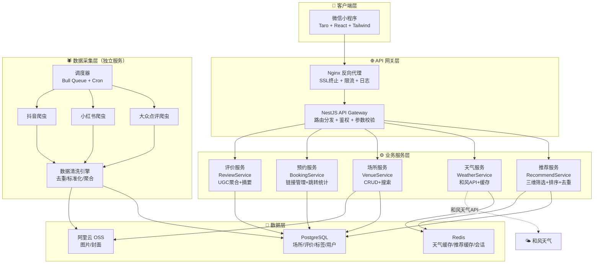
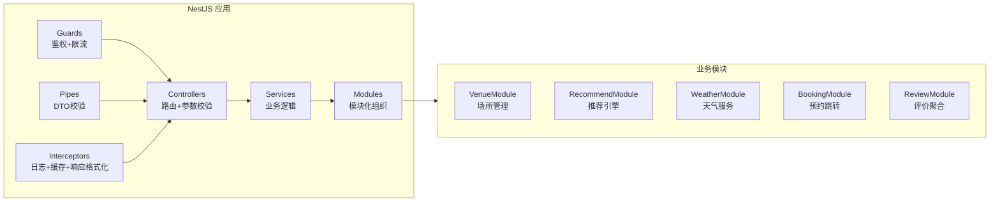
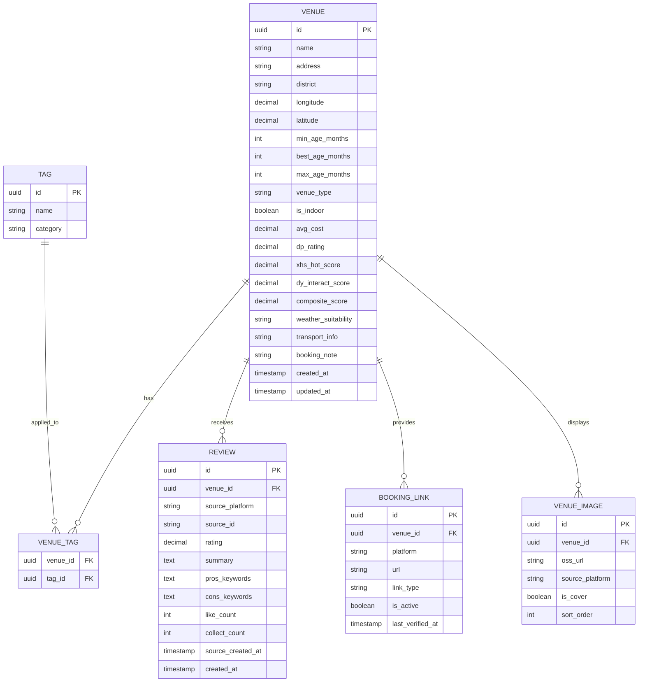
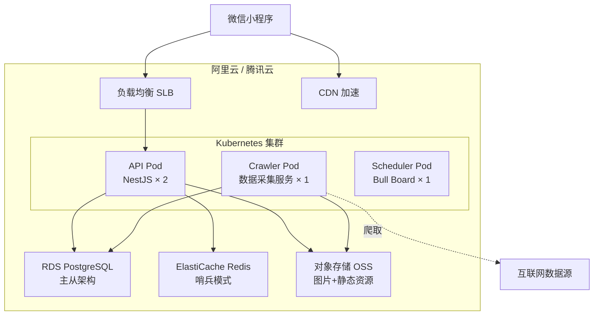
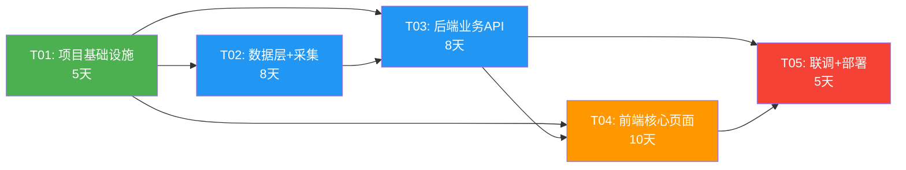

# 系统架构设计与开发计划

> **项目名称**：上海周末遛娃推荐小程序（shanghai_kidplay）  
> **文档版本**：v1.0  
> **编写日期**：2025-07-09  
> **角色**：架构师 - 高见远（Gao）

---

## 目录

1. [系统架构设计](#1-系统架构设计)
2. [技术选型明细](#2-技术选型明细)
3. [文件结构](#3-文件结构)
4. [核心数据结构设计](#4-核心数据结构设计)
5. [API 接口设计](#5-api-接口设计)
6. [开发任务分解](#6-开发任务分解)
7. [开发里程碑与排期](#7-开发里程碑与排期)
8. [风险评估](#8-风险评估)

---

## 1. 系统架构设计

### 1.1 整体架构图



### 1.2 前端架构

```
┌──────────────────────────────────────────────────────────┐
│                     微信小程序（Taro 3）                    │
├──────────────────────────────────────────────────────────┤
│  页面层（Pages）                                          │
│  ┌──────┐ ┌──────────┐ ┌──────────┐ ┌────────────────┐ │
│  │ 首页  │ │推荐结果页 │ │方案详情页 │ │对比详情页       │ │
│  └──┬───┘ └────┬─────┘ └────┬─────┘ └──────┬─────────┘ │
├─────┼──────────┼────────────┼───────────────┼───────────┤
│  组件层（Components）                                     │
│  ┌──┴────┐ ┌────┴────┐ ┌───┴────┐ ┌──────┴──────┐     │
│  │AgePicker│ │PlanCard │ │VenueInfo│ │CompareTable │     │
│  │BudgetBar│ │WeatherTag│ │ReviewList│ │ShareCard   │     │
│  └────────┘ └─────────┘ └────────┘ └─────────────┘     │
├──────────────────────────────────────────────────────────┤
│  状态管理层（Zustand）                                    │
│  ┌──────────┐ ┌──────────┐ ┌──────────┐                │
│  │ userStore │ │recStore  │ │venueStore│                │
│  │ 年龄/位置 │ │推荐结果  │ │场所详情  │                │
│  └──────────┘ └──────────┘ └──────────┘                │
├──────────────────────────────────────────────────────────┤
│  服务层（Services）                                       │
│  ┌──────────┐ ┌──────────┐ ┌──────────┐                │
│  │apiService│ │weatherSvc│ │shareSvc  │                │
│  └──────────┘ └──────────┘ └──────────┘                │
├──────────────────────────────────────────────────────────┤
│  基础设施层                                               │
│  Taro.request封装 / 路由守卫 / 错误边界 / 埋点上报        │
└──────────────────────────────────────────────────────────┘
```

**关键设计决策**：

| 决策 | 方案 | 理由 |
|------|------|------|
| 跨端框架 | Taro 3 | 微信小程序官方推荐级支持，React 生态丰富 |
| 状态管理 | Zustand | 轻量（<1KB），API简洁，Taro适配好 |
| 样式方案 | Tailwind CSS | 原子化CSS快速开发，配合自定义字体大小系统 |
| 字体适配 | 自定义 design tokens | 祖辈友好：提供"标准/大号/超大"三级字体 |

### 1.3 后端架构



**后端分层职责**：

| 层级 | 职责 | 示例 |
|------|------|------|
| Controller | 接收请求、参数校验、响应格式化 | `RecommendController.getTop3()` |
| Service | 核心业务逻辑、事务管理 | `RecommendService.generateTop3()` |
| Repository | 数据访问、ORM 映射 | `VenueRepository.findByFilter()` |
| Guard | 鉴权、接口限流 | `RateLimitGuard` |
| Interceptor | 统一响应格式、缓存、日志 | `CacheInterceptor`, `TransformInterceptor` |

### 1.4 数据架构



### 1.5 部署架构



**MVP 部署方案（简化版）**：

MVP 阶段无需 K8s，使用单机部署：

| 组件 | 方案 | 规格 |
|------|------|------|
| 应用服务器 | ECS 单机 | 2核4G |
| 数据库 | RDS PostgreSQL | 1核2G |
| 缓存 | Redis | 1G |
| 对象存储 | OSS | 按量 |
| 域名+SSL | 云服务 | ICP备案 |

---

## 2. 技术选型明细

### 2.1 前端框架

| 技术 | 版本 | 选型理由 |
|------|------|----------|
| **Taro** | ^4.x | 京东出品，微信小程序兼容性最佳；React 语法降低学习成本；社区活跃，插件丰富 |
| **React** | ^18.x | Taro 4 原生支持；函数式组件 + Hooks 开发效率高；生态丰富 |
| **Zustand** | ^4.x | 轻量（<1KB），无 Provider 包裹，TypeScript 友好，比 Redux 简洁 |
| **Tailwind CSS** | ^3.x | 原子化CSS加速开发；Taro 有 tailwind 插件（`taro-plugin-tailwind`）；配合自定义设计系统灵活 |
| **Taro UI** | ^3.x | 补充 Taro 原生组件，提供 Toast、Modal 等基础交互组件 |

### 2.2 后端框架

| 技术 | 版本 | 选型理由 |
|------|------|----------|
| **NestJS** | ^10.x | 模块化架构天然适配多业务模块；内置 Guard/Pipe/Interceptor 机制完善；TypeORM 集成好；TypeScript 全栈统一 |
| **TypeORM** | ^0.3.x | NestJS 官方推荐 ORM；TypeScript 装饰器语法；PostgreSQL 支持完善；Migration 机制成熟 |
| **Bull** | ^4.x | 基于 Redis 的任务队列；定时爬虫调度；失败重试+死信队列；Bull Board 可视化监控 |

### 2.3 数据库选型

| 技术 | 用途 | 选型理由 |
|------|------|----------|
| **PostgreSQL** | 主数据库 | 场所地理位置查询需 PostGIS 扩展；JSON 字段灵活存储平台原始数据；开源免费，性能足够支撑 MVP |
| **Redis** | 缓存+队列 | 天气API结果缓存（TTL 30min）；推荐结果缓存（TTL 1h）；Bull 队列底层存储；Session 管理 |

### 2.4 第三方服务选型

| 服务 | 供应商 | 用途 | 备选 |
|------|--------|------|------|
| **天气API** | 和风天气 | 周末天气预报（3天预报+实时） | 心知天气 |
| **地图/定位** | 腾讯位置服务 | 用户定位+距离计算+逆地址解析 | 高德地图 |
| **图片存储** | 阿里云 OSS | 场所图片+UGC图片存储+CDN分发 | 腾讯云 COS |
| **监控告警** | Sentry | 前后端异常监控+性能追踪 | — |
| **日志** | 阿里云 SLS | 服务端日志采集+检索 | ELK 自建 |

### 2.5 数据采集方案选型

| 技术 | 用途 | 选型理由 |
|------|------|----------|
| **Puppeteer** | 大众点评数据采集 | 反反爬能力较好；支持 Headless Chrome 渲染动态页面 |
| **Playwright** | 小红书数据采集 | 多浏览器支持；自动化操作稳定；可模拟移动端 |
| **HTTP 请求库** | 抖音数据采集 | 抖音 Web 端接口相对固定，HTTP 直接调用效率更高 |
| **cheerio** | HTML 解析 | 轻量级 jQuery 式 API，解析速度极快 |
| **node-cron** | 定时调度 | 轻量，配合 Bull 队列实现任务调度 |
| **Bull Queue** | 任务队列 | 爬虫任务分发+并发控制+失败重试+去重 |

> ⚠️ **合规注意**：数据采集需严格遵守各平台 robots.txt 和 ToS。MVP 阶段建议以人工运营+半自动采集为主，降低合规风险。详见[风险评估](#8-风险评估)。

---

## 3. 文件结构

### 3.1 前端项目文件树

```
miniapp/
├── project.config.json          # 微信小程序项目配置
├── project.private.config.json  # 私有配置（appid等）
├── package.json
├── babel.config.js
├── tsconfig.json
├── tailwind.config.ts           # Tailwind 配置（含自定义字体大小系统）
├── .env                         # 环境变量
├── .env.production
│
├── src/
│   ├── app.ts                   # Taro 入口
│   ├── app.config.ts            # 页面路由配置
│   ├── app.scss                 # 全局样式
│   │
│   ├── pages/                   # 页面
│   │   ├── index/               # 首页（3步快速推荐）
│   │   │   ├── index.tsx
│   │   │   ├── index.config.ts
│   │   │   └── index.scss
│   │   ├── recommend/           # 推荐结果页（Top3卡片）
│   │   │   ├── index.tsx
│   │   │   ├── index.config.ts
│   │   │   └── index.scss
│   │   ├── detail/              # 方案详情页
│   │   │   ├── index.tsx
│   │   │   ├── index.config.ts
│   │   │   └── index.scss
│   │   └── compare/             # 对比详情页
│   │       ├── index.tsx
│   │       ├── index.config.ts
│   │       └── index.scss
│   │
│   ├── components/              # 通用组件
│   │   ├── AgePicker/           # 年龄段选择器
│   │   ├── BudgetSelector/      # 预算档位选择
│   │   ├── WeatherTag/          # 天气标签组件
│   │   ├── PlanCard/            # 推荐方案卡片
│   │   ├── CompareTable/        # 对比表格
│   │   ├── VenueInfo/           # 场所信息卡
│   │   ├── ReviewList/          # 评价列表
│   │   ├── BookingButton/       # 预约跳转按钮
│   │   ├── ShareCard/           # 分享卡片
│   │   └── EmptyState/          # 空状态提示
│   │
│   ├── stores/                  # Zustand 状态管理
│   │   ├── useUserStore.ts      # 用户偏好（年龄/位置/字体大小）
│   │   ├── useRecommendStore.ts # 推荐结果状态
│   │   └── useVenueStore.ts     # 场所详情状态
│   │
│   ├── services/                # API 服务层
│   │   ├── api.ts               # Taro.request 封装（拦截器+错误处理）
│   │   ├── recommendService.ts  # 推荐 API
│   │   ├── venueService.ts      # 场所 API
│   │   ├── weatherService.ts    # 天气 API
│   │   └── bookingService.ts    # 预约 API
│   │
│   ├── constants/               # 常量定义
│   │   ├── ageGroups.ts         # 年龄段枚举
│   │   ├── budgetLevels.ts      # 预算档位枚举
│   │   ├── weatherTypes.ts      # 天气类型枚举
│   │   └── venueTypes.ts        # 场所类型枚举
│   │
│   ├── types/                   # TypeScript 类型定义
│   │   ├── venue.ts
│   │   ├── recommend.ts
│   │   ├── weather.ts
│   │   └── api.ts
│   │
│   ├── utils/                   # 工具函数
│   │   ├── distance.ts          # 距离计算
│   │   ├── format.ts            # 格式化（价格/日期/评分）
│   │   └── share.ts             # 分享功能封装
│   │
│   └── styles/                  # 样式相关
│       ├── theme.ts             # 主题变量（字体大小系统）
│       └── animations.scss      # 全局动画
│
└── __tests__/                   # 测试
    ├── pages/
    └── components/
```

### 3.2 后端项目文件树

```
server/
├── package.json
├── tsconfig.json
├── nest-cli.json
├── .env
├── .env.production
│
├── src/
│   ├── main.ts                        # NestJS 入口
│   ├── app.module.ts                  # 根模块
│   │
│   ├── common/                        # 公共模块
│   │   ├── decorators/                # 自定义装饰器
│   │   ├── filters/                   # 异常过滤器
│   │   ├── guards/                    # 守卫（限流等）
│   │   ├── interceptors/             # 拦截器（响应格式化、缓存、日志）
│   │   ├── pipes/                     # 管道（DTO校验）
│   │   └── dto/                       # 公共DTO
│   │       └── pagination.dto.ts
│   │
│   ├── modules/
│   │   ├── venue/                     # 场所模块
│   │   │   ├── venue.module.ts
│   │   │   ├── venue.controller.ts
│   │   │   ├── venue.service.ts
│   │   │   ├── venue.repository.ts
│   │   │   ├── dto/
│   │   │   │   ├── query-venue.dto.ts
│   │   │   │   └── create-venue.dto.ts
│   │   │   └── entities/
│   │   │       ├── venue.entity.ts
│   │   │       ├── venue-tag.entity.ts
│   │   │       ├── booking-link.entity.ts
│   │   │       └── venue-image.entity.ts
│   │   │
│   │   ├── review/                    # 评价模块
│   │   │   ├── review.module.ts
│   │   │   ├── review.controller.ts
│   │   │   ├── review.service.ts
│   │   │   ├── dto/
│   │   │   │   └── query-review.dto.ts
│   │   │   └── entities/
│   │   │       └── review.entity.ts
│   │   │
│   │   ├── tag/                       # 标签模块
│   │   │   ├── tag.module.ts
│   │   │   ├── tag.controller.ts
│   │   │   ├── tag.service.ts
│   │   │   └── entities/
│   │   │       └── tag.entity.ts
│   │   │
│   │   ├── recommend/                 # 推荐模块（核心）
│   │   │   ├── recommend.module.ts
│   │   │   ├── recommend.controller.ts
│   │   │   ├── recommend.service.ts
│   │   │   ├── dto/
│   │   │   │   └── recommend-query.dto.ts
│   │   │   ├── strategies/            # 推荐策略
│   │   │   │   ├── weather.strategy.ts
│   │   │   │   ├── age.strategy.ts
│   │   │   │   ├── budget.strategy.ts
│   │   │   │   └── composite.strategy.ts
│   │   │   └── types/
│   │   │       └── recommend-result.ts
│   │   │
│   │   ├── weather/                   # 天气模块
│   │   │   ├── weather.module.ts
│   │   │   ├── weather.controller.ts
│   │   │   ├── weather.service.ts
│   │   │   └── dto/
│   │   │       └── weather-query.dto.ts
│   │   │
│   │   └── booking/                   # 预约模块
│   │       ├── booking.module.ts
│   │       ├── booking.controller.ts
│   │       ├── booking.service.ts
│   │       └── dto/
│   │           └── booking-click.dto.ts
│   │
│   └── config/                        # 配置
│       ├── database.config.ts
│       ├── redis.config.ts
│       ├── weather.config.ts
│       └── oss.config.ts
│
├── migrations/                        # TypeORM 迁移文件
│   └── *.ts
│
└── test/                              # 测试
    ├── modules/
    └── e2e/
```

### 3.3 数据采集服务文件树

```
crawler/
├── package.json
├── tsconfig.json
├── .env
│
├── src/
│   ├── main.ts                        # 入口（Bull Queue Worker）
│   │
│   ├── schedulers/                    # 调度器
│   │   ├── dzdp.scheduler.ts         # 大众点评定时任务
│   │   ├── xhs.scheduler.ts          # 小红书定时任务
│   │   └── dy.scheduler.ts           # 抖音定时任务
│   │
│   ├── spiders/                       # 爬虫实现
│   │   ├── base.spider.ts            # 基类（重试、限速、代理）
│   │   ├── dzdp.spider.ts            # 大众点评爬虫
│   │   ├── xhs.spider.ts             # 小红书爬虫
│   │   └── dy.spider.ts              # 抖音爬虫
│   │
│   ├── cleaners/                      # 数据清洗
│   │   ├── deduplicator.ts           # 去重引擎（名称+地址模糊匹配）
│   │   ├── address-normalizer.ts     # 地址标准化
│   │   ├── price-extractor.ts        # 价格提取
│   │   ├── age-tagger.ts            # 年龄标注
│   │   └── score-aggregator.ts      # 评分聚合计算
│   │
│   ├── storage/                       # 数据入库
│   │   └── venue-updater.ts          # 场所数据更新（增量+全量）
│   │
│   ├── proxy/                         # 代理管理
│   │   └── proxy-pool.ts             # 代理IP池管理
│   │
│   └── utils/
│       ├── request.ts                # HTTP请求封装（重试+限速）
│       └── logger.ts                 # 日志工具
│
└── test/
```

---

## 4. 核心数据结构设计

### 4.1 场所（Venue）数据模型

```typescript
// server/src/modules/venue/entities/venue.entity.ts

@Entity('venues')
export class Venue {
  @PrimaryGeneratedUUID()
  id: string;

  @Column({ length: 100 })
  name: string;                    // 场所名称，如"上海自然博物馆"

  @Column({ length: 200 })
  address: string;                 // 标准化地址，如"静安区北京西路510号"

  @Column({ length: 20 })
  district: string;                // 行政区，如"静安"

  @Column({ type: 'decimal', precision: 10, scale: 6 })
  longitude: number;               // 经度

  @Column({ type: 'decimal', precision: 10, scale: 6 })
  latitude: number;                // 纬度

  @Column({ name: 'min_age_months', default: 0 })
  minAgeMonths: number;            // 最低适用年龄（月），如 6

  @Column({ name: 'best_age_months', default: 12 })
  bestAgeMonths: number;           // 最佳适用年龄（月），如 24

  @Column({ name: 'max_age_months', default: 72 })
  maxAgeMonths: number;            // 最大适用年龄（月），如 72

  @Column({ name: 'venue_type', length: 50 })
  venueType: string;               // 场所类型：museum/park/playground/farm/pool etc.

  @Column({ name: 'is_indoor', default: false })
  isIndoor: boolean;               // 是否室内

  @Column({ name: 'avg_cost', type: 'decimal', precision: 8, scale: 2 })
  avgCost: number;                 // 一大一小预估费用（元）

  @Column({ name: 'dp_rating', type: 'decimal', precision: 3, scale: 1, nullable: true })
  dpRating: number;                // 大众点评评分（0-5）

  @Column({ name: 'xhs_hot_score', type: 'decimal', precision: 5, scale: 1, nullable: true })
  xhsHotScore: number;             // 小红书热度分（收藏数归一化 0-100）

  @Column({ name: 'dy_interact_score', type: 'decimal', precision: 5, scale: 1, nullable: true })
  dyInteractScore: number;         // 抖音互动分（点赞+评论归一化 0-100）

  @Column({ name: 'composite_score', type: 'decimal', precision: 5, scale: 2 })
  compositeScore: number;          // 加权综合评分 = dpRating*0.4 + xhsHotScore/20*0.35 + dyInteractScore/20*0.25

  @Column({ name: 'weather_suitability', length: 50, default: 'all' })
  weatherSuitability: string;      // 天气适配：outdoor/indoor/all

  @Column({ name: 'transport_info', type: 'jsonb', nullable: true })
  transportInfo: {                 // 交通信息（JSON）
    metro?: string;                // 地铁线路，如"2号线南京西路站"
    parking?: boolean;             // 是否有停车场
    drivingMinutes?: number;       // 驾车预估时间
  };

  @Column({ name: 'booking_note', length: 200, nullable: true })
  bookingNote: string;             // 预约提示，如"需提前1天预约"

  @Column({ name: 'cover_url', nullable: true })
  coverUrl: string;                // 封面图 OSS URL

  @Column({ name: 'is_active', default: true })
  isActive: boolean;               // 是否上架

  @CreateDateColumn({ name: 'created_at' })
  createdAt: Date;

  @UpdateDateColumn({ name: 'updated_at' })
  updatedAt: Date;

  // 关联
  @OneToMany(() => VenueTag, vt => vt.venue)
  venueTags: VenueTag[];

  @OneToMany(() => Review, r => r.venue)
  reviews: Review[];

  @OneToMany(() => BookingLink, bl => bl.venue)
  bookingLinks: BookingLink[];

  @OneToMany(() => VenueImage, vi => vi.venue)
  images: VenueImage[];
}
```

### 4.2 评价（Review）数据模型

```typescript
// server/src/modules/review/entities/review.entity.ts

@Entity('reviews')
export class Review {
  @PrimaryGeneratedUUID()
  id: string;

  @Column({ name: 'venue_id' })
  venueId: string;

  @Column({ name: 'source_platform', length: 20 })
  sourcePlatform: string;          // 来源平台：dzdp/xhs/dy

  @Column({ name: 'source_id', length: 100 })
  sourceId: string;                // 平台原始ID，用于去重

  @Column({ type: 'decimal', precision: 3, scale: 1, nullable: true })
  rating: number;                  // 原始评分

  @Column({ type: 'text', nullable: true })
  summary: string;                 // NLP提炼的评价摘要

  @Column({ name: 'pros_keywords', type: 'simple-array', nullable: true })
  prosKeywords: string[];          // 好评关键词，如["距离近","性价比高","设施新"]

  @Column({ name: 'cons_keywords', type: 'simple-array', nullable: true })
  consKeywords: string[];          // 差评关键词，如["停车难","周末人多"]

  @Column({ name: 'like_count', default: 0 })
  likeCount: number;               // 点赞数

  @Column({ name: 'collect_count', default: 0 })
  collectCount: number;            // 收藏数

  @Column({ name: 'source_created_at', nullable: true })
  sourceCreatedAt: Date;           // 原始发布时间

  @CreateDateColumn({ name: 'created_at' })
  createdAt: Date;

  // 关联
  @ManyToOne(() => Venue, v => v.reviews)
  venue: Venue;
}
```

### 4.3 标签（Tag）数据模型

```typescript
// server/src/modules/tag/entities/tag.entity.ts

@Entity('tags')
export class Tag {
  @PrimaryGeneratedUUID()
  id: string;

  @Column({ length: 30, unique: true })
  name: string;                    // 标签名称，如"大运动"

  @Column({ length: 20 })
  category: string;                // 标签分类：edu_value/venue_feature/suitable_for

  // 关联
  @OneToMany(() => VenueTag, vt => vt.tag)
  venueTags: VenueTag[];
}

@Entity('venue_tags')
export class VenueTag {
  @PrimaryColumn()
  venueId: string;

  @PrimaryColumn()
  tagId: string;

  @ManyToOne(() => Venue, v => v.venueTags)
  venue: Venue;

  @ManyToOne(() => Tag, t => t.venueTags)
  tag: Tag;
}
```

### 4.4 推荐结果数据模型

推荐结果为实时计算生成，不持久化到数据库（通过 Redis 缓存）。

```typescript
// server/src/modules/recommend/types/recommend-result.ts

/** 单个推荐方案 */
export interface RecommendPlan {
  venue: {
    id: string;
    name: string;
    coverUrl: string;
    district: string;
    venueType: string;
    isIndoor: boolean;
    avgCost: number;
    compositeScore: number;
    transportInfo: TransportInfo;
  };
  matchInfo: {
    ageMatch: 'best' | 'suitable' | 'marginal';     // 年龄匹配度
    weatherMatch: 'perfect' | 'good' | 'backup';     // 天气匹配度
    budgetLevel: 'economy' | 'quality' | 'premium';  // 预算档位
  };
  tags: {
    eduValues: string[];      // 早教价值标签
    features: string[];       // 场所特征标签
  };
  pros: string[];             // 优势列表
  cons: string[];             // 劣势列表
  bookingLinks: {
    platform: string;
    url: string;
    type: 'miniapp' | 'h5' | 'phone';
  }[];
}

/** Top3 推荐结果 */
export interface RecommendResult {
  requestId: string;          // 请求唯一ID
  query: {
    ageGroup: string;         // 查询年龄段
    weather: WeatherInfo;     // 天气信息
    budgetLevel: string;      // 预算档位
  };
  plans: RecommendPlan[];     // Top3 方案
  backupPlan?: RecommendPlan; // 天气备选方案
  generatedAt: Date;
  cacheExpireAt: Date;
}
```

---

## 5. API 接口设计

### 5.1 核心API列表

所有 API 统一响应格式：

```typescript
interface ApiResponse<T> {
  code: number;       // 0=成功, 非0=错误码
  data: T;
  message: string;
}
```

#### 5.1.1 推荐接口（核心）

| 接口 | 方法 | 路径 | 说明 |
|------|------|------|------|
| 获取Top3推荐 | GET | `/api/v1/recommend/top3` | 根据天气+年龄+预算返回Top3方案 |
| 获取Top10完整列表 | GET | `/api/v1/recommend/list` | 返回完整推荐列表（分页） |

**GET `/api/v1/recommend/top3`**

```
请求参数：
  ageGroup: string       必填  年龄段 "0-1" | "1-3" | "3-6"
  budgetLevel: string    必填  预算档 "economy" | "quality" | "premium"
  district: string       选填  行政区筛选
  longitude: number      选填  用户经度（距离计算）
  latitude: number       选填  用户纬度（距离计算）

响应数据：
{
  code: 0,
  data: {
    requestId: "uuid",
    weather: {
      condition: "sunny" | "rainy" | "cloudy" | "hot" | "cold",
      temperature: 28,
      description: "周六晴 28°C / 周日多云 25°C",
      source: "qweather"
    },
    plans: [
      {
        venue: { id, name, coverUrl, district, venueType, isIndoor, avgCost, compositeScore, transportInfo },
        matchInfo: { ageMatch, weatherMatch, budgetLevel },
        tags: { eduValues: ["大运动", "感官"], features: ["有停车场"] },
        pros: ["距离近", "性价比高"],
        cons: ["周末人多需排队"],
        bookingLinks: [{ platform: "大众点评", url: "...", type: "miniapp" }]
      },
      // ... 方案B, 方案C
    ],
    backupPlan: { /* 同plan结构 */ },
    generatedAt: "2025-07-09T10:00:00Z",
    cacheExpireAt: "2025-07-09T11:00:00Z"
  },
  message: "success"
}
```

#### 5.1.2 场所接口

| 接口 | 方法 | 路径 | 说明 |
|------|------|------|------|
| 获取场所详情 | GET | `/api/v1/venues/:id` | 场所完整信息+评价+预约链接 |
| 搜索场所 | GET | `/api/v1/venues` | 按条件搜索场所列表（分页） |

**GET `/api/v1/venues/:id`**

```
响应数据：
{
  code: 0,
  data: {
    id, name, address, district, longitude, latitude,
    minAgeMonths, bestAgeMonths, maxAgeMonths,
    venueType, isIndoor, avgCost,
    dpRating, xhsHotScore, dyInteractScore, compositeScore,
    weatherSuitability, transportInfo, bookingNote, coverUrl,
    tags: [{ id, name, category }],
    images: [{ ossUrl, isCover, sortOrder }],
    reviews: {
      total: 156,
      summary: "家长普遍好评...",
      prosKeywords: ["距离近", "性价比高"],
      consKeywords: ["停车难"],
      topReviews: [{ sourcePlatform, summary, rating, prosKeywords, consKeywords }]
    },
    bookingLinks: [{ platform, url, type, isActive }]
  }
}
```

**GET `/api/v1/venues`**

```
请求参数：
  ageGroup?: string       选填  年龄段筛选
  district?: string       选填  行政区筛选
  venueType?: string      选填  场所类型筛选
  isIndoor?: boolean      选填  室内/户外筛选
  budgetLevel?: string    选填  预算档筛选
  keyword?: string        选填  关键词搜索
  page?: number           选填  页码（默认1）
  pageSize?: number       选填  每页数量（默认10，最大50）
  sortBy?: string         选填  排序字段 compositeScore|avgCost|distance
  longitude?: number      选填  距离排序时必传
  latitude?: number       选填  距离排序时必传
```

#### 5.1.3 天气接口

| 接口 | 方法 | 路径 | 说明 |
|------|------|------|------|
| 获取周末天气 | GET | `/api/v1/weather/weekend` | 返回周六日天气预报 |

**GET `/api/v1/weather/weekend`**

```
请求参数：
  district?: string       选填  行政区（默认上海全市）

响应数据：
{
  code: 0,
  data: {
    saturday: {
      date: "2025-07-12",
      condition: "sunny",
      tempHigh: 32,
      tempLow: 25,
      description: "晴"
    },
    sunday: {
      date: "2025-07-13",
      condition: "cloudy",
      tempHigh: 30,
      tempLow: 24,
      description: "多云"
    },
    recommendation: "outdoor",     // outdoor | indoor | mixed
    summary: "周六晴好适合户外，周日多云可室内外兼顾"
  }
}
```

#### 5.1.4 预约接口

| 接口 | 方法 | 路径 | 说明 |
|------|------|------|------|
| 获取预约链接 | GET | `/api/v1/booking/venue/:venueId` | 获取场所的预约渠道列表 |
| 记录跳转行为 | POST | `/api/v1/booking/click` | 记录用户预约跳转（统计用） |

**POST `/api/v1/booking/click`**

```
请求体：
{
  venueId: string,
  platform: string,        // 跳转平台
  linkType: string         // miniapp | h5 | phone
}

响应：
{
  code: 0,
  data: { recorded: true },
  message: "success"
}
```

#### 5.1.5 对比接口

| 接口 | 方法 | 路径 | 说明 |
|------|------|------|------|
| 获取方案对比 | POST | `/api/v1/recommend/compare` | 传入多个venueId返回对比数据 |

**POST `/api/v1/recommend/compare`**

```
请求体：
{
  venueIds: string[],      // 2-3个场所ID
  ageGroup: string,
  longitude?: number,
  latitude?: number
}

响应数据：
{
  code: 0,
  data: {
    dimensions: [
      {
        name: "综合评分",
        values: [4.8, 4.6, 4.5]
      },
      {
        name: "预估费用",
        values: [89, 168, 152],
        format: "price"
      },
      {
        name: "距离",
        values: ["5.2km", "8.1km", "3.4km"]
      }
      // ... 更多维度
    ],
    pros: [
      ["距离近+性价比高", "寓教于乐+内容丰富", "适合低龄+下雨也能玩"]
    ],
    cons: [
      ["下雨不适用", "距离稍远", "人流量大需预约"]
    ]
  }
}
```

---

## 6. 开发任务分解

### Phase 1：项目基础设施（T01）

| 编号 | 任务名称 | 任务描述 | 工时 | 依赖 | 负责角色 |
|------|----------|----------|------|------|----------|
| T01 | **项目基础设施搭建** | 初始化前端+后端+数据库项目骨架：前端 Taro 初始化 + Tailwind 配置 + 路由配置 + API 服务封装 + Zustand store 骨架 + 常量/类型定义；后端 NestJS 初始化 + TypeORM 配置 + PostgreSQL 连接 + Redis 连接 + 公共模块（Guards/Interceptors/Pipes/Filters）+ 统一响应格式 + 数据库 Migration 初始化；数据采集服务初始化 + Bull Queue 配置 | 5天 | 无 | 全栈工程师 |

**涉及文件**：
- 前端：`package.json`, `project.config.json`, `tailwind.config.ts`, `tsconfig.json`, `src/app.ts`, `src/app.config.ts`, `src/app.scss`, `src/services/api.ts`, `src/stores/*.ts`, `src/constants/*.ts`, `src/types/*.ts`
- 后端：`package.json`, `nest-cli.json`, `tsconfig.json`, `src/main.ts`, `src/app.module.ts`, `src/common/**`, `src/config/**`
- 采集：`package.json`, `tsconfig.json`, `src/main.ts`

### Phase 2：数据层（T02）

| 编号 | 任务名称 | 任务描述 | 工时 | 依赖 | 负责角色 |
|------|----------|----------|------|------|----------|
| T02 | **数据模型+数据采集+种子数据** | 定义所有 Entity（Venue/Review/Tag/VenueTag/BookingLink/VenueImage）+ TypeORM Migration + Repository 层；实现数据采集爬虫（大众点评+小红书+抖音）+ 数据清洗引擎（去重/地址标准化/价格提取/年龄标注/评分聚合）+ 定时调度；编写种子数据脚本（人工精选50个场所） | 8天 | T01 | 后端工程师 |

**涉及文件**：
- 后端 Entity：`src/modules/venue/entities/*.entity.ts`, `src/modules/review/entities/*.entity.ts`, `src/modules/tag/entities/*.entity.ts`
- 后端 Repository：`src/modules/venue/venue.repository.ts`
- 后端 Migration：`migrations/*.ts`
- 采集服务：`src/spiders/*.spider.ts`, `src/cleaners/*.ts`, `src/schedulers/*.scheduler.ts`, `src/storage/venue-updater.ts`, `src/proxy/proxy-pool.ts`, `src/utils/*.ts`
- 种子数据脚本

### Phase 3：后端业务服务（T03）

| 编号 | 任务名称 | 任务描述 | 工时 | 依赖 | 负责角色 |
|------|----------|----------|------|------|----------|
| T03 | **后端核心业务API** | 实现所有业务模块 Service+Controller：推荐服务（三维筛选策略+Top3生成+差异度选择+缓存）、天气服务（和风API对接+Redis缓存+推荐映射）、场所服务（详情+搜索+分页）、评价服务（UGC摘要+关键词）、预约服务（链接管理+跳转统计+对比接口）；集成测试 | 8天 | T01, T02 | 后端工程师 |

**涉及文件**：
- `src/modules/recommend/**`（推荐策略：weather.strategy.ts, age.strategy.ts, budget.strategy.ts, composite.strategy.ts）
- `src/modules/weather/**`
- `src/modules/venue/venue.controller.ts`, `src/modules/venue/venue.service.ts`
- `src/modules/review/review.controller.ts`, `src/modules/review/review.service.ts`
- `src/modules/booking/booking.controller.ts`, `src/modules/booking/booking.service.ts`
- `src/modules/tag/tag.controller.ts`, `src/modules/tag/tag.service.ts`
- 所有 DTO 文件
- `test/**`

### Phase 4：前端核心页面（T04）

| 编号 | 任务名称 | 任务描述 | 工时 | 依赖 | 负责角色 |
|------|----------|----------|------|------|----------|
| T04 | **前端核心页面+组件** | 实现所有页面和组件：首页（AgePicker+BudgetSelector+天气自动获取+快速入口）+ 推荐结果页（PlanCard 卡片列表+天气标签+备选提示）+ 方案详情页（VenueInfo+ReviewList+BookingButton+避坑提示）+ 对比详情页（CompareTable+优劣势分析）；Zustand store 完整实现；API 服务对接；样式实现（祖辈友好字体系统+大按钮+高对比度） | 10天 | T01, T03 | 前端工程师 |

**涉及文件**：
- 页面：`src/pages/index/**`, `src/pages/recommend/**`, `src/pages/detail/**`, `src/pages/compare/**`
- 组件：`src/components/AgePicker/**`, `src/components/BudgetSelector/**`, `src/components/WeatherTag/**`, `src/components/PlanCard/**`, `src/components/CompareTable/**`, `src/components/VenueInfo/**`, `src/components/ReviewList/**`, `src/components/BookingButton/**`, `src/components/ShareCard/**`, `src/components/EmptyState/**`
- Store：`src/stores/useRecommendStore.ts`, `src/stores/useVenueStore.ts`, `src/stores/useUserStore.ts`
- 服务：`src/services/recommendService.ts`, `src/services/venueService.ts`, `src/services/weatherService.ts`, `src/services/bookingService.ts`
- 工具：`src/utils/distance.ts`, `src/utils/format.ts`, `src/utils/share.ts`
- 样式：`src/styles/theme.ts`, `src/styles/animations.scss`

### Phase 5：集成调试+部署（T05）

| 编号 | 任务名称 | 任务描述 | 工时 | 依赖 | 负责角色 |
|------|----------|----------|------|------|----------|
| T05 | **前后端联调+部署上线** | 前后端接口联调+异常处理+边界情况；部署环境搭建（ECS+RDS+Redis+OSS+Nginx+SSL）；微信小程序审核提审；性能优化（首屏加载+缓存策略）；监控告警配置（Sentry+SLS）；E2E 测试 | 5天 | T03, T04 | 全栈工程师 |

**涉及文件**：
- Nginx 配置
- 部署脚本（Dockerfile, docker-compose.yml）
- CI/CD 配置
- 环境变量配置
- 小程序审核材料

### 任务汇总

| 编号 | 任务名称 | 工时 | 依赖 | 优先级 |
|------|----------|------|------|--------|
| T01 | 项目基础设施搭建 | 5天 | 无 | P0 |
| T02 | 数据模型+数据采集+种子数据 | 8天 | T01 | P0 |
| T03 | 后端核心业务API | 8天 | T01, T02 | P0 |
| T04 | 前端核心页面+组件 | 10天 | T01, T03 | P0 |
| T05 | 前后端联调+部署上线 | 5天 | T03, T04 | P0 |

> **总工时**：36 人天（约 7.2 周单人，或 3-4 周双人并行）

### 任务依赖图



**关键路径**：T01 → T02 → T03 → T04 → T05（36天串行）  
**优化并行**：T02 完成后，T03 和 T04 部分（Mock数据开发）可并行，实际约 **4-5 周**完成 MVP。

---

## 7. 开发里程碑与排期

### 7.1 MVP 版本（P0 功能）— 目标：6 周

> MVP 仅包含 P0 功能，确保核心体验闭环：3步选择 → Top3推荐 → 详情 → 预约跳转

| 周次 | 日期范围 | 里程碑 | 交付物 |
|------|----------|--------|--------|
| W1 | 第1周 | 项目启动+基础设施 | T01 完成：前后端项目骨架可运行，数据库 Migration 执行成功 |
| W2-W3 | 第2-3周 | 数据层+后端API | T02 完成：种子数据入库，爬虫可定时运行；T03 开始开发 |
| W3-W4 | 第3-4周 | 后端API+前端页面 | T03 完成：所有 API 接口可用；T04 同步启动（Mock 数据开发页面） |
| W4-W5 | 第4-5周 | 前端页面开发 | T04 完成：4个核心页面全部实现，组件库完整 |
| W5-W6 | 第5-6周 | 联调+部署+提审 | T05 完成：前后端联调通过，部署到生产环境，微信审核提审 |

**MVP 交付功能**：
- ✅ 首页3步快速推荐（年龄+天气+预算）
- ✅ Top3 推荐结果展示
- ✅ 方案详情页（场所信息+评价摘要+预约链接）
- ✅ Top3 方案对比表格
- ✅ 预约渠道跳转（大众点评小程序+H5+电话）
- ✅ 天气自动获取+智能推荐映射
- ✅ 50个种子场所数据

### 7.2 V1.0 版本（P0+P1 功能）— 目标：MVP后4周

| 周次 | 里程碑 | 新增功能 |
|------|--------|----------|
| W7-W8 | P1 功能开发 | 早教价值标签、UGC评价摘要（NLP提炼）、方案分享到家庭群、定位与距离计算、收藏与历史 |
| W9 | P1 功能测试+优化 | P1 功能联调+性能优化+体验打磨 |
| W10 | V1.0 发布 | V1.0 正式上线，启动小规模推广 |

**V1.0 新增功能**：
- ✅ 早教价值标签（感官发展/大运动/精细动作/语言启蒙/社交启蒙）
- ✅ UGC 评价摘要（好评关键词+避坑提示，NLP 自动提炼）
- ✅ 方案分享（生成卡片图片分享到家庭群）
- ✅ 基于用户位置的距离计算
- ✅ 收藏与历史推荐记录

### 7.3 V2.0 版本（全部功能）— 目标：V1.0后6周

| 周次 | 里程碑 | 新增功能 |
|------|--------|----------|
| W11-W13 | P2 功能开发 | 智能日历提醒、遛娃打卡地图、社区UGC、亲子活动日历聚合 |
| W14-W15 | AI对话推荐 | 集成 LLM 实现自然语言对话式推荐 |
| W15-W16 | V2.0 发布+运营 | 全功能上线+运营推广 |

**V2.0 新增功能**：
- ✅ 周四主动推送遛娃推荐（订阅消息）
- ✅ 遛娃打卡地图
- ✅ 社区UGC（用户提交遛娃体验）
- ✅ 亲子活动日历（场馆排期聚合）
- ✅ AI 对话推荐（自然语言交互）

### 里程碑甘特图

```
Week  1  2  3  4  5  6  7  8  9  10 11 12 13 14 15 16
      ├──────────────────┤                        MVP (P0)
      │  T01 T02 T03 T04 T05
      │                   ├─────────┤             V1.0 (P0+P1)
      │                     P1开发  测试 发布
      │                              ├───────────────┤ V2.0 (全部)
      │                                P2开发  AI  发布
```

---

## 8. 风险评估

### 8.1 技术风险

| 风险 | 概率 | 影响 | 应对策略 |
|------|------|------|----------|
| **爬虫反爬机制升级** | 高 | 高 | ① MVP 以人工运营+种子数据为主，降低对爬虫的依赖 ② 预留代理IP池 ③ 优先评估官方API合作可能性 ④ 降低采集频率（每周1次全量） |
| **和风天气API精度不足** | 中 | 中 | ① MVP 按全市天气推荐 ② 缓存策略降低API调用量 ③ 预留切换到心知天气的接口抽象层 |
| **推荐算法冷启动** | 高 | 高 | ① 运营团队人工精选50个种子场所 ② 初始排序以人工编辑权重为主 ③ 收集早期用户反馈优化算法 |
| **小程序审核被拒** | 中 | 高 | ① 提前研究微信小程序审核规范 ② 数据来源标注清晰 ③ 预约跳转使用官方渠道 ④ 预留1周审核缓冲时间 |
| **PostGIS 地理查询性能** | 低 | 中 | ① 建立地理索引 ② MVP 数据量小（<1000场所），性能无忧 ③ 预留 Elasticsearch 升级路径 |

### 8.2 数据合规风险

| 风险 | 概率 | 影响 | 应对策略 |
|------|------|------|----------|
| **爬取数据违反平台ToS** | 高 | 高 | ① **最高优先级**：法务咨询各平台ToS ② 仅聚合公开信息，不存储原始UGC全文 ③ 评价内容为NLP提炼摘要（非原文复制） ④ 标注数据来源 ⑤ 探索官方API/数据合作 |
| **个人信息保护法合规** | 中 | 高 | ① 用户位置信息仅用于距离计算，不持久化存储 ② 隐私政策+用户协议提前准备 ③ 收藏/历史数据支持用户删除 ④ 最小化数据采集原则 |
| **UGC内容合规** | 中 | 中 | ① 评价摘要经过 NLP 过滤敏感词 ② 人工审核机制 ③ 用户举报通道 |

### 8.3 运营风险

| 风险 | 概率 | 影响 | 应对策略 |
|------|------|------|----------|
| **数据更新不及时** | 中 | 高 | ① 定时爬虫+人工运营双保险 ② 预约链接可用性自动检测 ③ 用户报错反馈机制 |
| **推荐质量不足** | 中 | 高 | ① 冷启动期人工精选保证底线质量 ② 建立用户反馈闭环（"推荐有用/没用"按钮） ③ 持续优化推荐算法权重 |
| **用户获取困难** | 高 | 中 | ① 利用微信生态社交传播（分享到家庭群） ② 内容营销（小红书/公众号种草） ③ 种子用户邀请机制 |
| **祖辈用户使用障碍** | 中 | 中 | ① 祖辈友好设计（大字体+少输入+语音播报） ② 家庭群分享降低使用门槛 ③ 简化操作流程（3步即达） |

---

## 附录：共享知识（Shared Knowledge）

> 以下为工程师实施时需统一遵守的规范：

```
1. 所有 API 响应使用 { code: number, data: T, message: string } 格式
2. code=0 表示成功，非0为错误码（1001=参数错误, 2001=数据不存在, 3001=外部服务异常）
3. 所有日期字段使用 ISO 8601 UTC 格式
4. 金额单位统一为"元"（人民币），类型为 decimal，保留2位小数
5. 年龄统一用"月"为单位存储，前端展示时转换为"0-1岁/1-3岁/3-6岁"
6. 距离计算使用 Haversine 公式，单位 km，保留1位小数
7. 天气缓存 TTL=30分钟，推荐结果缓存 TTL=1小时
8. 场所综合评分 = 大众点评评分×0.4 + 小红书热度/20×0.35 + 抖音互动/20×0.25
9. 预算分档：economy(0-100元), quality(100-200元), premium(200元以上)，按"一大一小"计算
10. 前端字体大小系统：standard(14px), large(16px), xlarge(18px)，可在设置中切换
11. 所有接口需限流：同一用户每分钟最多30次请求
12. 微信小程序appid和秘钥不硬编码，通过环境变量注入
```

---

*文档结束。如有疑问，请联系架构师高见远（Gao）。*
